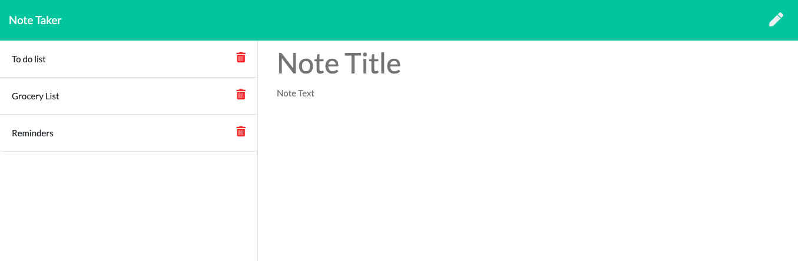

# Note Taker

# Description

An application for note taking that can be used to write, save and delete notes. Application is using Express.js backend, heroku to deploy website and is written in javascript.

### Table of Contents

- [Installation](#installation)
- [Usage](#usage)

- [Questions](#questions)

## Installation

Run npm install command from the root of the project folder to utilize the code. Or go to https://note-taker-hc.herokuapp.com/ to use the app directly.

## Usage

Enter note title and text and click on the save button, click on the delete button to the right of the note in order to delete.: 

## Questions

- Got questions? [email me](mailto:caspi.home@gmail.com) 
- [My GitHub profile](https://github.com/hcs847)
